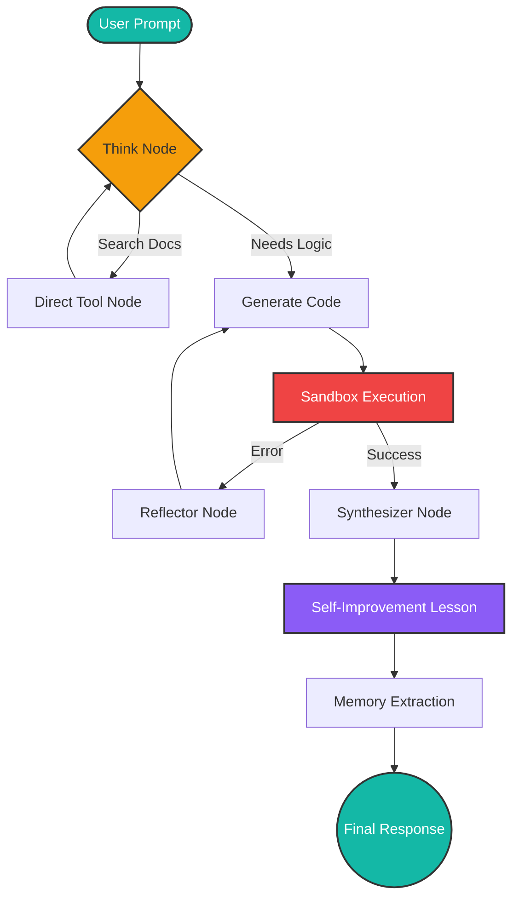

<div align="center">
  
  <h1>🐍 Ouroboros</h1>
  <p><strong>The Recursive Self-Improving AI Architect</strong></p>
  <p><i>A project by <b>Organic Vision</b></i></p>

  [](https://www.python.org/)
  [](https://github.com/langchain-ai/langgraph)
  [](https://github.com/stanfordnlp/dspy)
  [](https://clickhouse.com/)
  [](https://aws.amazon.com/bedrock/)
</div>

---

## 🚀 Overview

**Ouroboros** is a state-of-the-art Agentic AI system designed for autonomous problem-solving and self-evolution. Unlike traditional linear AI, Ouroboros implements a **cybernetic feedback loop** where the agent writes, executes, critiques, and learns from its own code in real-time.

Named after the ancient symbol of a snake eating its own tail, Ouroboros represents the pinnacle of **Recursive Self-Improvement**—an AI that doesn't just solve tasks, but actively learns how to solve them better next time.

## ✨ Key Features

- **🧠 System 2 Thinking**: Deep reasoning powered by **Claude 3.5 Sonnet** and **DSPy**'s Chain-of-Thought.
- **🔄 Reflexion Loop**: Autonomous debugging—the agent analyzes stack traces and self-corrects until victory.
- **📈 Self-Improvement**: A dedicated **Ouroboros Loop** that generates "lessons learned" after every task, storing them in RAG to avoid future mistakes.
- **📂 Multimodal RAG**: Instant knowledge retrieval from uploaded PDFs, Text, and Markdown files using **ClickHouse Vector Search**.
- **📦 Secure Sandboxing**: All code runs in isolated **Docker containers**, ensuring host safety and deterministic results.
- **🛰️ Long-term Memory**: Persistent state tracking and fact extraction using a high-performance **ClickHouse** backend.

---

## 🛠️ Technology Stack

| Layer | Technology |
| :--- | :--- |
| **Orchestration** | [LangGraph](https://github.com/langchain-ai/langgraph) |
| **Cognition** | [DSPy](https://github.com/stanfordnlp/dspy) + AWS Bedrock (Claude 3.5 Sonnet) |
| **Database** | [ClickHouse](https://clickhouse.com/) (Vector Search + Metrics + Checkpoints) |
| **Embeddings** | Amazon Titan Text Embeddings v2 |
| **Sandbox** | Docker (Custom Python 3.12 Environment) |
| **Frontend** | [Streamlit](https://streamlit.io/) (Teal Native Theme) |

---

## 🏗️ Architecture

Ouroboros operates on a sophisticated state-graph logic that mimics human expert workflows:



---

## 📥 Installation

1. **Clone the repository**:
   ```bash
   git clone https://github.com/mhd12e/Ouroboros.git
   cd Ouroboros
   ```

2. **Environment Setup**:
   Create a `.env` file with your credentials:
   ```env
   AWS_ACCESS_KEY_ID=xxx
   AWS_SECRET_ACCESS_KEY=xxx
   AWS_REGION=us-east-1

   CLICKHOUSE_HOST=xxx.clickhouse.cloud
   CLICKHOUSE_PORT=8443
   CLICKHOUSE_USER=default
   CLICKHOUSE_PASSWORD=xxx
   ```

3. **Install Dependencies**:
   ```bash
   pip install -r requirements.txt
   ```

4. **Launch Ouroboros**:
   ```bash
   streamlit run app.py
   ```

---

## 📁 Project Structure

```text
├── app.py                 # Streamlit UI (Chat, Files, MCP)
├── src/
│   ├── graph.py           # LangGraph state machine & logic
│   ├── cognition.py       # DSPy signatures & cognitive modules
│   ├── db.py              # ClickHouse connection & bootstrap
│   ├── rag.py             # Vector search & lesson retrieval
│   ├── sandbox.py         # Docker execution engine
│   ├── state.py           # AgentState definition
│   └── tools.py           # Direct backend tools (SQL/Files/RAG)
└── .gitignore             # The ultimate gitignore
```

---

<div align="center">
  <p>Built with ❤️ by <b>Organic Vision</b></p>
  <p><i>Empowering the next generation of Agentic AI.</i></p>
</div>
